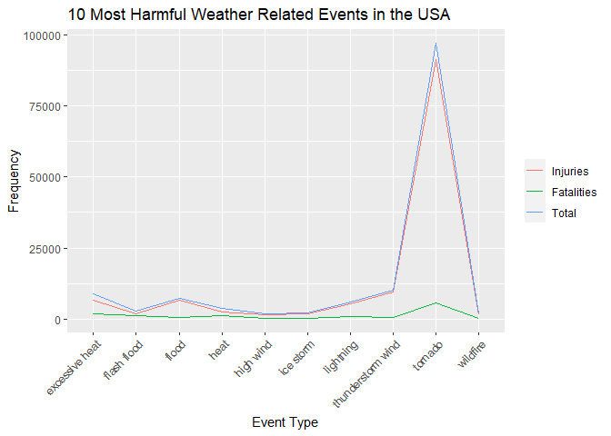
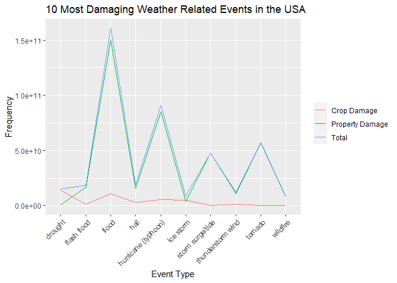

## Synopsis

The goal of this report is to explore the NOAA Storm Database and effects of severe weather events on both population and economy.The database covers the time period between 1950 and November 2011.

The following analysis investigates which types of severe weather events are most harmful (injuries and fatalities) and damaging (property and crops)

More information on the Data: [Documentation](https://d396qusza40orc.cloudfront.net/repdata%2Fpeer2_doc%2FNCDC%20Storm%20Events-FAQ%20Page.pdf)

## Loading and preprocessing the data


```r
library(ggplot2)
library(dplyr)
library(reshape2)

data <- read.csv("repdata_data_StormData.csv")
```

Subsetting data, choosing only columns that we use in this report: "EVTYPE", "FATALITIES", "INJURIES", "PROPDMG", "PROPDMGEXP", "CROPDMG", "CROPDMGEXP"

```r
df<-subset(data, select=c(8, 23, 24, 25, 26, 27, 28))
```
Choosing rows that have value more than 0 in at least one of these variables: 
"FATALITIES", "INJURIES", "PROPDMG", "CROPDMG"

```r
df<-subset(df, df$FATALITIES!=0 | df$INJURIES!=0 | df$PROPDMG!=0 | df$CROPDMG!=0)
```
Changing all event names to lowercase

```r
df$EVTYPE<-tolower(df$EVTYPE)
```
Setting vector with all "correct" names of the events to compare with the dataframe

```r
evprop<-tolower(c("Astronomical Low Tide", "Avalanche", "Blizzard", "Coastal Flood", "Cold/Wind Chill", "Debris Flow", "Dense Fog", "Dense Smoke", "Drought", "Dust Devil", "Dust Storm", "Excessive Heat", "Extreme Cold/Wind Chill", "Flash Flood", "Flood", "Frost/Freeze", "Funnel Cloud", "Freezing Fog", "Hail", "Heat", "Heavy Rain", "Heavy Snow", "High Surf", "High Wind", "Hurricane (Typhoon)", "Ice Storm", "Lake-Effect Snow", "Lakeshore Flood", "Lightning", "Marine Hail", "Marine High Wind", "Marine Strong Wind", "Marine Thunderstorm Wind", "Rip Current", "Seiche", "Sleet", "Storm Surge/Tide", "Strong Wind", "Thunderstorm Wind", "Tornado", "Tropical Depression", "Tropical Storm", "Tsunami", "Volcanic Ash", "Waterspout", "Wildfire", "Winter Storm", "Winter Weather"))
```
Changing some of the typos globally

```r
df$EVTYPE<-gsub("tstm","thunderstorm", df$EVTYPE)
df$EVTYPE<-gsub("^\\s+","", df$EVTYPE) #removing leading white space
df$EVTYPE<-gsub("\\d+$","", df$EVTYPE) #removing numbers from the end
df$EVTYPE<-gsub("\\(\\d+\\)$","", df$EVTYPE) # removing numbers in brackets at the end
df$EVTYPE<-gsub("\\(g\\d+\\)$","", df$EVTYPE) # removing "g" and numbers in brackets at the end
df$EVTYPE<-gsub("[.]$","", df$EVTYPE) # removing dot at the end
df$EVTYPE<-gsub("\\s+[A-Za-z0-9]$","", df$EVTYPE) #removing any leftover single character or single number preceded by space
df$EVTYPE<-gsub("mph$","", df$EVTYPE) #removing "mph" at the end 
df$EVTYPE<-gsub("\\s+$","", df$EVTYPE) #removing white space at the end
df$EVTYPE<-gsub("\\s+[0-9]+$","", df$EVTYPE) #removing numbers at the end preceded by white space
df$EVTYPE<-gsub("\\s+[0-9]+\\)$","", df$EVTYPE) #removing numbers at the end preceded by white space and followed by single closing bracket
```

Checking all the unique names one by one  and changing it to the "correct" name

```r
df <- df %>% 
        mutate(EVTYPE = case_when(
                EVTYPE %in% c("coastal flooding", "erosion/cstl flood", "tidal flooding", "coastal flooding/erosion", "coastal  flooding/erosion") ~ "coastal flood"
                ,EVTYPE %in% c("avalance" ) ~ "avalanche"
                ,EVTYPE %in% c("cold", "cold wave", "unseasonably cold", "low temperature", "high winds/cold", "cold/winds", "cold weather", "unseasonable cold", "extended cold", "cold temperature"  ) ~ "cold/wind chill"
                ,EVTYPE %in% c("blowing dust" ) ~ "dust storm"
                ,EVTYPE %in% c("extreme heat", "record heat" ) ~ "excessive heat"
                ,EVTYPE %in% c("extreme cold", "extreme wind chill", "record cold", "extreme windchill" ) ~ "extreme cold/wind chill"
                ,EVTYPE %in% c("flash flooding", "flash flood/", "urban flood", "urban/small stream flood", "urban flooding", "minor flooding", "flash floods", "small stream flood", "urban and small stream floodin", "flash flood/ street", "flood flash", "flood/flash", "flash flood/flood", "flash flooding/flood", "flood/flashflood", "urban floods", "urban/sml stream fld", "flood/flash/flood" ) ~ "flash flood"
                ,EVTYPE %in% c("flooding", "breakup flooding", "river flood", "floods", "rural flood", "major flood", "ice jam flooding", "river and stream flood", "river flooding", "flood/river flood", "snowmelt flooding", "ice jam flood (minor" ) ~ "flood"
                ,EVTYPE %in% c("freeze", "damaging freeze", "frost", "frost\\freeze", "hard freeze", "early frost", "agricultural freeze"  ) ~ "frost/freeze"
                ,EVTYPE %in% c("fog" ) ~ "freezing fog"
                ,EVTYPE %in% c("hailstorm", "hail damage", "small hail" ) ~ "hail"
                ,EVTYPE %in% c("heat wave", "unseasonably warm", "heat waves", "unseasonably warm and dry", "record/excessive heat", "warm weather" ) ~ "heat"
                ,EVTYPE %in% c("heavy rains", "record rainfall", "rainstorm", "heavy rain/severe weather", "rain", "hvy rain", "heavy precipitation", "excessive rainfall", "heavy shower", "torrential rainfall", "unseasonal rain") ~ "heavy rain"
                ,EVTYPE %in% c("heavy snowpack", "snow", "snow and heavy snow", "snow/heavy snow", "heavy snow squalls", "snow squall", "heavy snow/squalls", "heavy snow-squalls", "record snow", "snow squalls", "blowing snow", "heavy snow shower", "excessive snow" ) ~ "heavy snow"
                ,EVTYPE %in% c("high tides", "heavy surf", "high waves", "rough surf", "high surf advisory", "hazardous surf", "heavy surf/high surf" ) ~ "high surf"
                ,EVTYPE %in% c("high winds", "wind", "high wind damage", "high winds/", "high  winds" ) ~ "high wind"
                ,EVTYPE %in% c("hurricane erin", "hurricane opal/high winds", "hurricane opal", "hurricane", "hurricane-generated swells", "hurricane emily", "hurricane gordon", "hurricane felix", "hurricane edouard", "typhoon", "hurricane/typhoon") ~ "hurricane (typhoon)"
                ,EVTYPE %in% c("snow and ice storm", "snow/ice storm", "ice/strong winds" ) ~ "ice storm"
                ,EVTYPE %in% c("lake flood") ~ "lakeshore flood"
                ,EVTYPE %in% c("lightning injury", "ligntning", "lightning fire", "lightning  wauseon", "lighting" ) ~ "lightning"
                ,EVTYPE %in% c("rip currents" ) ~ "rip current"
                ,EVTYPE %in% c("storm surge", "coastal surge") ~ "storm surge/tide"
                ,EVTYPE %in% c("gusty winds", "winds", "strong winds", "wind damage", "storm force winds", "gusty wind", "non-severe wind damage", "non thunderstorm wind", "non-thunderstorm wind" ) ~ "strong wind"
                ,EVTYPE %in% c("thunderstorm winds", "thunderstorm wins", "severe thunderstorm", "severe thunderstorms", "severe thunderstorm winds", "thunderstorms winds", "thunderstorms", "thunderstorm windss", "thundertorm winds", "wind storm", "thunderstorm  winds", "thunderstorms wind", "tunderstorm wind", "thunderstorm", "thunderstorm wind/ trees", "thunderstorm wind/awning", "thunderstorm wind trees", "thunderstorm wind/ tree", "thunderstorm damage to", "thuderstorm winds", "thunderstorm winds and", "thunderstorm wind damage", "thunderestorm winds", "thundeerstorm winds", "thunerstorm winds", "thunderstormw", "thunderstormwinds", "thunderstrom wind" ) ~ "thunderstorm wind"
                ,EVTYPE %in% c("cold air tornado", "torndao", "tornadoes" ) ~ "tornado"
                ,EVTYPE %in% c("tropical storm alberto", "tropical storm gordon", "tropical storm jerry", "tropical storm dean") ~ "tropical storm"
                ,EVTYPE %in% c("waterspout-" ) ~ "waterspout"
                ,EVTYPE %in% c("wild fires", "grass fires", "forest fires", "wildfires", "wild/forest fire", "wild/forest fires", "brush fire" ) ~ "wildfire"
                ,EVTYPE %in% c("winter storms", "winter storm high winds" ) ~ "winter storm"
                ,EVTYPE %in% c("wintry mix", "winter weather mix", "winter weather/mix" ) ~ "winter weather"
                , TRUE ~ EVTYPE
        )
        )
```

Removing the records with names that cannot be identified, didn't fit any category or contain more than one category

```r
df<-subset(df,df$EVTYPE %in%evprop)
```

Changing exponential column

```r
df <- df %>% 
        mutate(PROPDMGEXP = case_when(
                PROPDMGEXP %in% c("K","k") ~ "1000"
                ,PROPDMGEXP %in% c("M","m") ~ "1000000"
                ,PROPDMGEXP %in% c("B","b") ~ "1000000000"
                ,PROPDMGEXP %in% c("H","h") ~ "100"
                ,PROPDMGEXP %in% c("-","?","") ~ "0"
                ,PROPDMGEXP %in% c("+") ~ "1"
                ,PROPDMGEXP %in% c("0","5","6","4","2","7","3") ~ "10"
                , TRUE ~ EVTYPE
        )
        )
df$PROPDMGEXP<-as.data.frame(sapply(df$PROPDMGEXP,as.numeric))

df <- df %>% 
        mutate(CROPDMGEXP = case_when(
                CROPDMGEXP %in% c("K","k") ~ "1000"
                ,CROPDMGEXP %in% c("M","m") ~ "1000000"
                ,CROPDMGEXP %in% c("B","b") ~ "1000000000"
                ,CROPDMGEXP %in% c("H","h") ~ "100"
                ,CROPDMGEXP %in% c("-","?","") ~ "0"
                ,CROPDMGEXP %in% c("+") ~ "1"
                ,CROPDMGEXP %in% c("0","5","6","4","2","7","3") ~ "10"
                , TRUE ~ EVTYPE
        )
        )
df$CROPDMGEXP<-as.data.frame(sapply(df$CROPDMGEXP,as.numeric))
```

Calculating new column with values and exponential

```r
df<-df%>%mutate(PROP_total=PROPDMG*PROPDMGEXP)
df<-df%>%mutate(CROP_total=CROPDMG*CROPDMGEXP)
```

Calculating sums for each event type

```r
df1<-df%>%group_by(EVTYPE)%>%summarise(inj=sum(INJURIES), fat=sum(FATALITIES))
df2<-df%>%group_by(EVTYPE)%>%summarise(ctotal=sum(CROP_total), ptotal=sum(PROP_total))
```

Calculating totals and sorting tables

```r
df1<-df1%>%mutate(total=inj+fat)%>%arrange(-total)
df2<-df2%>%mutate(total=ctotal+ptotal)%>%arrange(-total)
```

Subsetting tables to only top 10 records

```r
df1<-df1[1:10,]
df2<-df2[1:10,]
```

## Results

Plotting figure showing top 10 Most Harmful Weather Related Events to Population Health

```r
df1a<-melt(df1, id=c("EVTYPE"), value.name="frequency")
ggplot(df1a, aes(x=EVTYPE, y=frequency, group=variable, colour=variable))+
        geom_line()+
        ylab("Frequency")+
        xlab("Event Type")+
        theme(axis.text.x = element_text(angle=45, hjust=1))+
        ggtitle("10 Most Harmful Weather Related Events in the USA")+
        scale_colour_discrete(name="",breaks=c("inj", "fat", "total"),labels=c("Injuries", "Fatalities", "Total"))
```

<!-- -->

Plotting figure showing top 10 Most Damaging Weather Related Events to Property and Crop

```r
df2a<-melt(df2, id=c("EVTYPE"), value.name="frequency")
ggplot(df2a, aes(x=EVTYPE, y=frequency, group=variable, colour=variable))+
        geom_line()+
        ylab("Frequency")+
        xlab("Event Type")+
        theme(axis.text.x = element_text(angle=45, hjust=1))+
        ggtitle("10 Most Damaging Weather Related Events in the USA")+
        scale_colour_discrete(name="",breaks=c("ctotal", "ptotal", "total"),labels=c("Crop Damage", "Property Damage", "Total"))
```

<!-- -->
